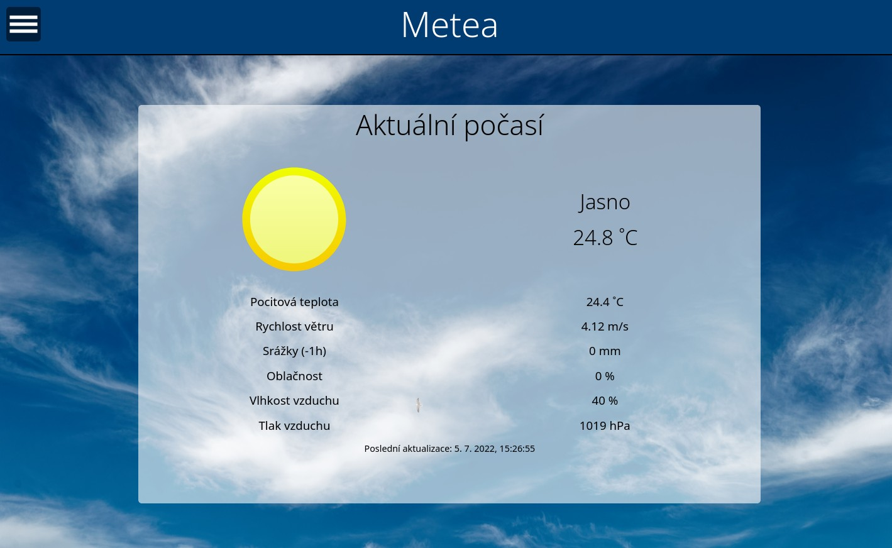
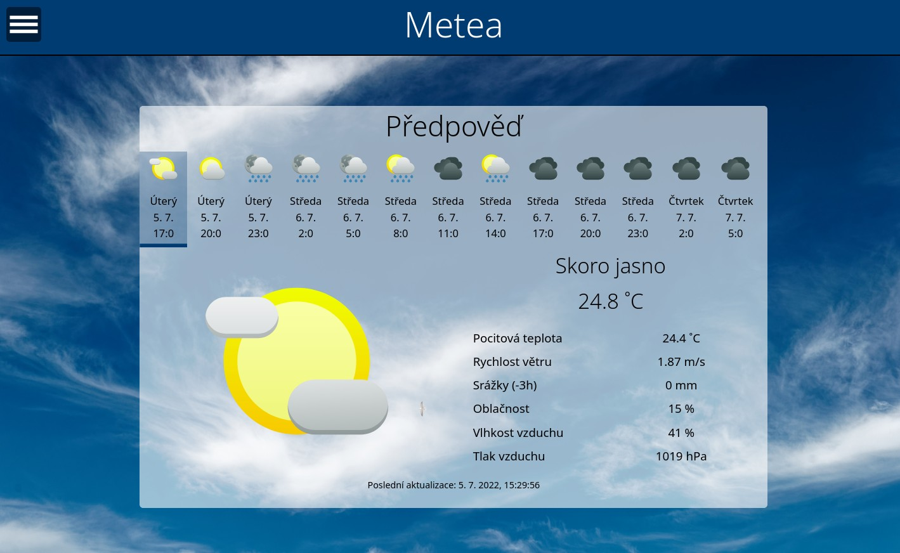
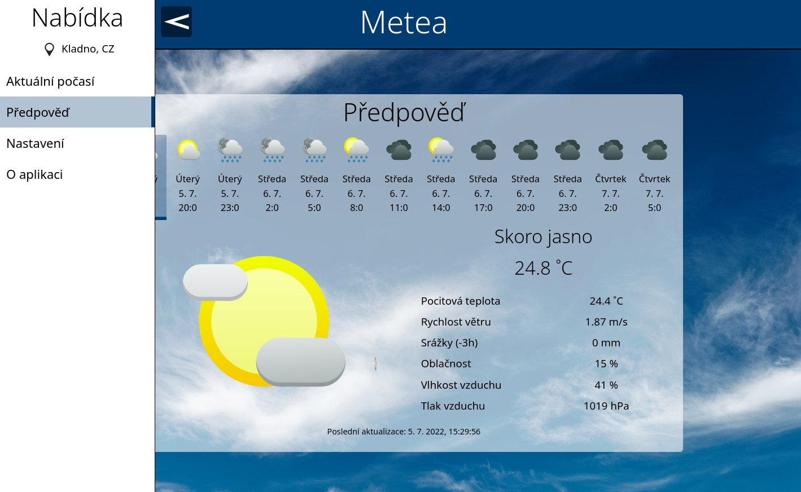

# Metea

Metea je aplikace zobrazující informace o počasí z OpenWeatherMap.

## Funkce

- Zobrazení informací o současném počasí
- Předpověď počasí na následujících 5 dní po třech hodinách
- Nastavitelný interval, po jehož uplynutí se počasí automaticky zaktualizuje

## Co je potřeba ještě dodělat?

- Přeložit Meteu do i do jiných jazyků
- Přidat možnost vyhledání místa (nyní lze přidat místo pouze podle souřadnic)

## Požadavky na spuštění

**Metea musí být pro správnou funkčnost umístěná na jakémkoliv webovém serveru. Při spuštění přímo ze správce souborů nemusí vše správně fungovat.**

Budete potřebovat také svůj API klíč od OpenWeatherMap. K jeho získání se musíte [zaregistrovat](https://home.openweathermap.org/users/sign_up). Bude Vám stačit služba zdarma.

## Obrázky

## Licence

Metea je licencována podle podmínek GNU GPLv3 (GNU General Public License version 3).

Metea obsahuje obrázky a knihovny třetích stran:

### KDE Breeze Icons

Licence: [LGPL 2.1 (GNU Lesser Genereal Public License version 2.1)](https://invent.kde.org/frameworks/breeze-icons/-/raw/master/COPYING.LIB)

Zdroj: [GitLab](https://invent.kde.org/frameworks/breeze-icons)

### Pozadí 

Název: *Texel - De Hors - Sky above the North Sea*

Autor: *Txllxt TxllxT*

Licence: [CC BY-SA 4.0](https://creativecommons.org/licenses/by-sa/4.0/deed.en)

Zdroj: [Wikimedia Commons](https://commons.wikimedia.org/wiki/File:Texel_-_De_Hors_-_Sky_above_the_North_Sea.jpg)
